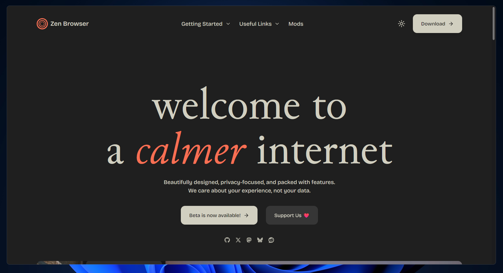
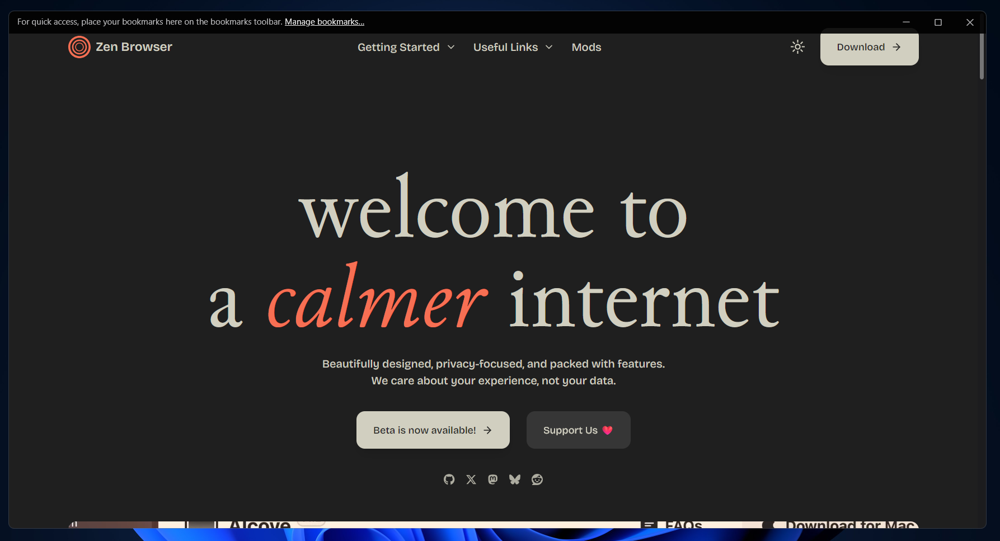
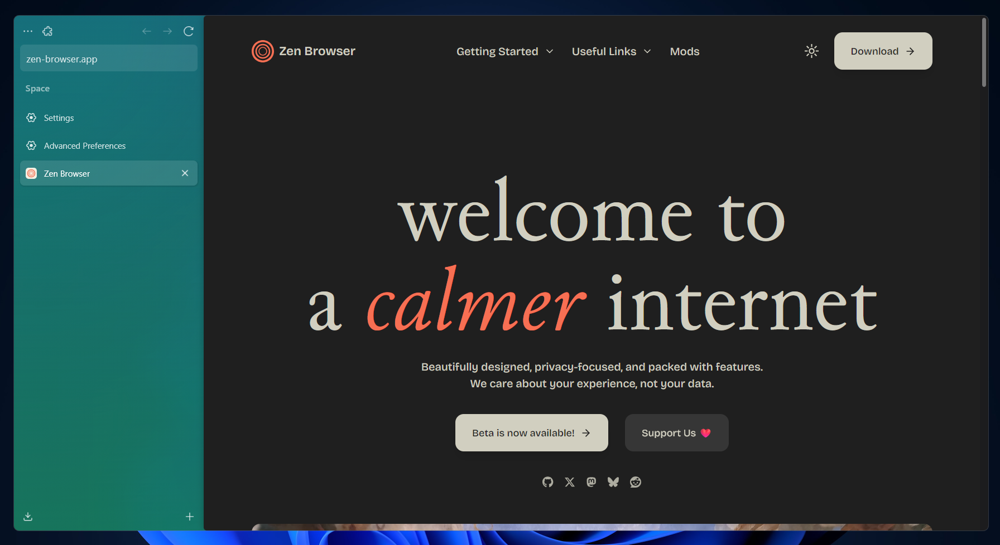
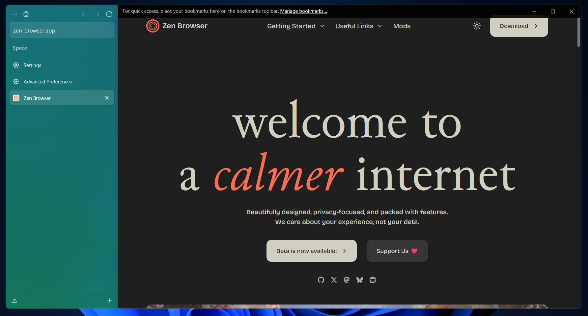

# 🧱 No-Gaps

A **minimalist UI enhancement** that removes unnecessary borders and gaps, creating a **cleaner, edge-to-edge look** for your browser — perfect for **split-screen mode** and maximizing screen real estate.

---

### To-Do List

- [ ] Removing gap when in split mode.
- [x] Retained the animation of the topbar i.e, minimize, maximize, close and bookmars top bar.
- [ ] Experimental border control

---

### Previews

  
Click to see the Previews

  
  - Compact Mode
  

  - Compact Mode With TopBar
  

  - Non Compact Mode
  

  - Non Compact Mode With TopBar
  

---

### 🧩 Overview
**No-Gaps** focuses on:
- Eliminating borders and visual clutter  
- Creating a seamless, modern interface  
- Enhancing multitasking efficiency on smaller or split displays  

This mod is proudly published by **[Vertex](https://github.com/Vertex-Mods)** — your home for high-quality Firefox mods.

---

### ⚙️ Recommended Installation (via Sine Mod Manager)

> 🔗 **Sine Mod Manager:** [https://github.com/CosmoCreeper/Sine](https://github.com/CosmoCreeper/Sine)

1. Go to `about:config` and search for `toolkit.legacyUserProfileCustomizations.stylesheets`, then set it to `true`. 
2. Download and install **Sine**.  
3. Open the Sine Mod Manager and search for **No-Gaps**.  
4. Click **Install** — that’s it!  

This method automatically handles setup and updates for you.

---

### 🧠 Manual Installation (Advanced)

1. Go to `about:config` and search for `toolkit.legacyUserProfileCustomizations.stylesheets`, then set it to `true`. 
2. Download the **latest release** of *No-Gaps* from this repository.  
3. Open `about:profiles` in Firefox.  
4. Under your profile, click **“Open Folder”** which the folder path says *Roaming* in between.  
5. Inside that folder, open the `chrome` directory (create one if it doesn’t exist).  
6. Place the mod files inside the `chrome` folder.  
7. Open `about:config` and add no-gap.mode-select preference which is number and set it to `1` (for only compact mode) or `2` (for both compact and non compact mode).

---

### 🧷 Credits
- Publisher: [Vertex Mods](https://github.com/Vertex-Mods)  
- Mod Manager: [Sine](https://github.com/CosmoCreeper/Sine)

---

**Clean. Minimal. Efficient. — No-Gaps.**
